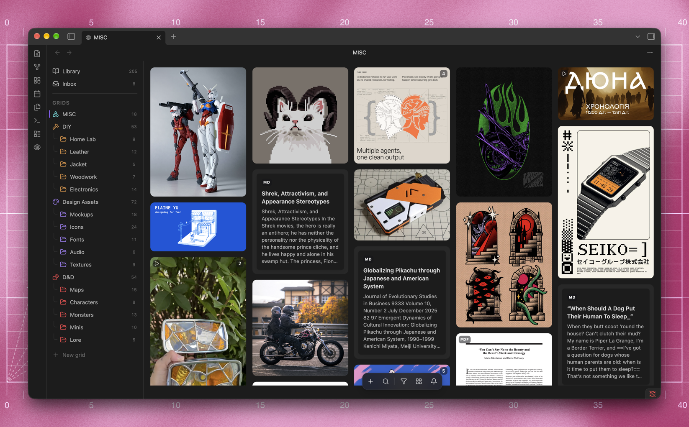
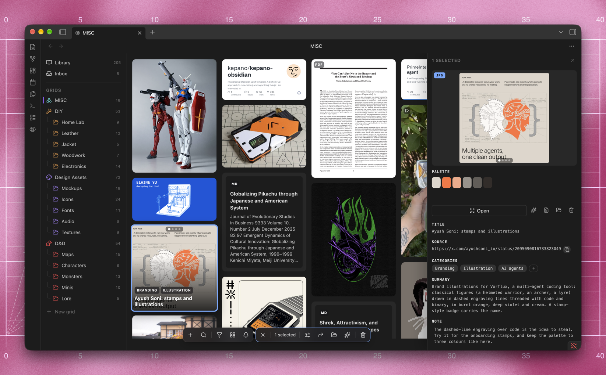
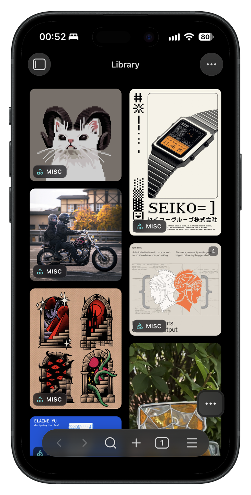

<div align="center">

```
 ██████     ██████    ██   ██   ██████
██        ██  ██  ██  ██  ██   ██    ██
██  ███  ██  ████  ██ █████    ██    ██
██   ██   ██  ██  ██  ██  ██   ██    ██
 ██████     ██████    ██   ██   ██████
```

# Goko

### Your links, images, videos and PDFs, on one wall you can see

*Collect from any app, sort into grids and folders, and find anything again.
It all stays in your Obsidian vault as plain files, with its media on your own
disk.*

**goko** is how some Ukrainian dialects say *око*, “eye”. You save links,
images, videos and documents, and Goko lets you see them instead of reading a
list of names.

[](https://github.com/artem-levchenko-2/obsidian-goko/releases/latest)
[](https://github.com/artem-levchenko-2/obsidian-goko/releases)
[](https://obsidian.md)
[](#install)
[](LICENSE)

&nbsp;

[](#install)
[](https://github.com/artem-levchenko-2/obsidian-goko/issues/new)
[](https://github.com/artem-levchenko-2/obsidian-goko/discussions)
[](CHANGELOG.md)

</div>



## Why

### Bookmarks keep the title. Goko keeps the picture.

Links rot, posts get deleted, and a folder of clippings is a list of names.
Goko puts everything you save on one wall, as the pictures and video you saved
it for, and copies them into your vault so they outlive the page.

- ✂️&nbsp; **Clip from anywhere.** Paste a link, drop a file, or share from any
  app on your phone. Posts from Instagram, X, Threads, Pinterest and YouTube
  arrive with their pictures and video.
- 💾&nbsp; **Keep it for good.** Every picture and video is downloaded into your
  vault, so a deleted post or a dead link does not take the clipping with it.
- 🍱&nbsp; **See it all at once.** A bento wall at each picture's own
  proportions, sorted into grids and folders, filtered by any property, and
  searchable by the words inside an article or a PDF.
- 📝&nbsp; **Own every file.** Each clipping is a plain Markdown note in the vault
  you already have. Goko writes its body once and after that edits only its
  frontmatter.

Free and open source, for Obsidian on desktop and on your phone.

---

## Contents

- ⬇&nbsp; [Install](#install)
- ✂️&nbsp; [Clip anything](#clip-anything)
- 🍱&nbsp; [The bento wall](#the-bento-wall)
- 🗂️&nbsp; [Grids and folders](#grids-and-folders)
- 🔍&nbsp; [Search](#search)
- 🤖&nbsp; [AI, if you want it](#ai-if-you-want-it)
- 🛠️&nbsp; [Optional tools](#optional-tools)
- 🔒&nbsp; [Privacy](#privacy)

---

## Install

In Obsidian, open **Settings → Community plugins → Browse**, search for Goko,
then choose **Install** and **Enable**. It needs Obsidian 1.13 or newer, on
desktop or mobile.

<details>
<summary>📦 <b>Install before it reaches the catalog</b></summary>

<br>

With [BRAT](https://github.com/TfTHacker/obsidian42-brat), updates arrive on
their own. Add Goko as a beta plugin:

```
Settings → BRAT → Add beta plugin
artem-levchenko-2/obsidian-goko
```

By hand, download `main.js`, `manifest.json` and `styles.css` from the
[latest release](https://github.com/artem-levchenko-2/obsidian-goko/releases/latest)
and put them in:

```
<your vault>/.obsidian/plugins/goko/
```

Then turn it on under **Settings → Community plugins → Goko**.

</details>

---

## Clip anything

Paste a link anywhere on the wall, or run **Clip from clipboard** from the
command palette. Goko reads the page, downloads what it finds, and writes a
note into your clippings folder.

| You paste | You get |
| :-- | :-- |
| An article or product page | Its preview image, title, author and date, plus the article's own text |
| An image, video or PDF | The file itself, as its own clipping. A PDF shows page one and gives its text to search |
| An Instagram post | Every picture of a carousel, full size, from the post's own embed |
| An X or Threads post | The post's media |
| A Pinterest pin | Its picture or video, from Pinterest itself |
| A YouTube video | Its cover and a button to watch it on YouTube. Shorts, and videos under the length you set, download with yt-dlp |
| A link with no picture | A card of the clipping's own words, with the site's mark |
| Something already clipped | The note you already have, raised on the wall |

<details>
<summary>📱 <b>Clipping from your phone's share sheet</b></summary>

<br>

Goko answers `obsidian://goko?url=…`, so an iOS Shortcut can put a clip button
in every app's share sheet. Build one that:

1. **Receives** URLs and text from the share sheet
2. Runs **Get URLs from Input**
3. **URL-encodes** the result
4. **Opens** `obsidian://goko?url=` followed by the encoded text

Share anything from Safari, Instagram or X and it lands on the wall. Text
around the link is fine. Share sheets send captions, and Goko finds the URL in
them.

</details>

<details>
<summary>📥 <b>Already using the Obsidian Web Clipper?</b></summary>

<br>

Its notes appear on the wall as they are. Goko reads the frontmatter the
clipper writes (`title`, `source`, `author`, `created`, `description`,
`tags`) and, on its own, downloads the remote images those notes point at, so
a library clipped over years stops depending on other people's servers.

The notes themselves are not rewritten. The command **Download all clipping
media** fetches the images for every note at once.

</details>

---

## The bento wall



Goko fills one screen with three parts. The rail on the left holds your
library, your inbox, and every grid with its folders and how much each holds.
The wall in the middle shows each clipping as its own picture, at its own
proportions. The panel on the right opens for the card you pick: the picture
and its palette, where it came from, its categories, the summary and your own
note, all editable in place.

Hover a card for its name and tags, or sweep across one with several pictures
to flip through them. Video plays in the panel with a timeline, and any frame
can become the card's cover.

Select several cards with a drag, or with a long press on a phone, and a bar
rises beside the dock to retag, move, describe or delete them all at once.



On a phone the same wall fits under a thumb, and the panel slides up from the
bottom.

<br clear="right">

<details>
<summary>⌨️ <b>Keys over the wall</b></summary>

<br>

| | |
| :-- | :-- |
| `⌘V` | Clip the link, picture or file on the clipboard |
| `⌘K` | Search |
| `⌘Z` `⌘⇧Z` | Undo and redo a move, an edit, a grid change |
| `⌘1` to `⌘9` | Switch grids in their stored order |
| `←` `→` `↑` `↓` | Move between tiles |
| `Esc` | Close whatever is open |

Use Ctrl in place of ⌘ on Windows and Linux. These work over the wall and
nowhere else. Goko registers no hotkeys of its
own, so it takes none of the ones you have already bound. Every command is in
Obsidian's palette, and Settings → Hotkeys is where you give one a chord if you
want it.

</details>

---

## Grids and folders

Grids are boards. A clipping belongs to one through a single `grid` property,
the library shows everything there is, and smart views collect clippings by
rule. The list of grids travels between your devices in one small note, so a
board made on a desktop is on your phone after a sync.

A rail down the left lists them with their folders and their counts. Drag
cards onto a row to file them, and drag the rows themselves to reorder them.
Folders are piles inside a grid. Gather some tiles into one card to make a
folder, a collage of what is inside, and drag its corner to set it to one, two
or three columns wide.

A board can change shape as it grows. Drag a folder out between the grids and
it becomes a grid of its own, in its old grid's icon and colour. Drop a grid
onto another, or between its folders, and it becomes one of them. **Make it a
grid** and **Make it a folder** in the menus do the same, and undo takes
either back.

<details>
<summary>📁 <b>Grids that are real folders</b></summary>

<br>

Turn on **Grids follow folders** and the wall files by path instead of by
frontmatter:

```
Clippings/                     the inbox
Clippings/Payments/            a grid
Clippings/Payments/Checkout/   a folder on that grid
```

Moving a card moves the note, and moving the note in Obsidian's file explorer
moves the card.

The setting is off by default, and turning it on moves nothing by itself. A
command does the moving, and the `grid` property keeps working either way.

</details>

<details>
<summary>✨ <b>Suggestions</b></summary>

<br>

The inbox can lay itself out by where each clipping probably belongs, read
from its categories, its domain, and rules you write yourself:

```
dribbble.com        categories: inspiration
*.behance.net       categories: portfolio, categories: branding
github.com          categories: code
```

Accept or correct a whole island in one gesture. Nothing moves until you say
so.

</details>

---

## Search

One input over the dimmed wall finds clippings and the things you can do to
them: actions, grids, filter values, and every clipping in the vault by name,
each with a preview.

Type `@` for grids and folders, or `#` for the tags your vault uses. Either one
settles into a chip that narrows what is left.

---

## AI, if you want it

It is off by default and does nothing until you turn it on. Then Goko can look
at a clipping and write a summary and categories into its frontmatter, as
ordinary properties you can edit or delete.

Select a pile of cards and describe them in one go. Goko works through them
several at a time, up to ten as **Descriptions at once** allows, shows the
count at the top of the wall with a Stop button, and stops by itself when the
provider says its limit is reached.

<details>
<summary>Three ways to run it</summary>

<br>

| Provider | What it needs |
| :-- | :-- |
| Anthropic | Your own API key |
| OpenAI | Your own API key |
| Claude Code | The CLI already on your machine, with no key and no second subscription |

A key you supply is kept in Obsidian's keychain on that device. It is not
written into your notes or the plugin's settings, and does not sync with the
vault.

Other models and agents work too, by a route Goko does not build in. Goko
reads `summary` and `categories` from a clipping's frontmatter, so a local
model, a coding agent such as Codex, Antigravity or Hermes, or any script that
can write to your vault, directly or through the Obsidian CLI, can fill them
in, and the wall shows the result.

</details>

---

## Optional tools

Everything above works with nothing installed. Two command-line programs make
Goko better at the media a browser cannot reach on its own, if you already
have them or care to install them. They are for the desktop only. Goko finds
them on `PATH` and in the usual install locations, and **Settings → Video
tools** takes an explicit path. On a Mac or on Windows, **Install** in the same
place runs Homebrew or winget for you.

| Tool | Without it | With it |
| :-- | :-- | :-- |
| [yt-dlp](https://github.com/yt-dlp/yt-dlp) | A clipped reel or post keeps its poster image | The video file itself, downloaded into your vault |
| [ffmpeg](https://ffmpeg.org) | A video in a format Obsidian cannot play has no tile | A still pulled from it, so the card has a picture |

```bash
# macOS
brew install yt-dlp ffmpeg

# Windows
winget install yt-dlp.yt-dlp
winget install Gyan.FFmpeg

# Linux
sudo apt install yt-dlp ffmpeg
```

<details>
<summary>📲 <b>How phones get videos they cannot download</b></summary>

<br>

Some video can only be fetched on a desktop, and a phone has no `yt-dlp`.

A clip made on your phone gets its poster right away and says so. The next
time a desktop opens the same vault, it notices what is missing and downloads
it. Once that syncs back, the phone adopts the file and the tile plays, with
nothing lost in between and nothing to clip again.

</details>

---

## Privacy

Goko has no server, analytics, telemetry or third-party SDKs.
Everything it keeps is written into your own vault.

It fetches the pages you clip. The one request that does not go straight to
the site is for a post on X. X publishes the address of a post's video only to
its own player, so Goko asks the community mirror `api.fxtwitter.com`, and you
can switch that off in the settings.

The full policy is in [PRIVACY.md](PRIVACY.md).

---

## License

Goko is free software under the GNU General Public License v3.0. See
[LICENSE](LICENSE) for the full terms, and [NOTICE](NOTICE) for the copyright
notices and the statement of what this program is a modified version of.

<div align="center">
<br>

Found a bug or missing something?
[Open an issue](https://github.com/artem-levchenko-2/obsidian-goko/issues/new) · [Start a discussion](https://github.com/artem-levchenko-2/obsidian-goko/discussions)

</div>
